<p align="center">
  <picture>
    <source media="(prefers-color-scheme: dark)" srcset="assets/brand/lockup-dark.svg">
    
  </picture>
</p>

<p align="center"><strong>Plan your day. Keep your data.</strong></p>

<p align="center">
  A calm, local-first dashboard for your tasks, calendar, money and people,<br>
  running on your own computer with Node.js and nothing else.
</p>

<p align="center">
  <a href="https://github.com/mahdi1190/opendash/actions/workflows/ci.yml"></a>
  <a href="https://github.com/mahdi1190/opendash/releases/latest"></a>
  <a href="LICENSE"></a>
  <a href="https://nodejs.org"></a>
  <a href="package.json"></a>
</p>

<p align="center">
  <a href="#quick-start">Quick start</a> ·
  <a href="#features">Features</a> ·
  <a href="docs/README.md">Documentation</a> ·
  <a href="docs/PRIVACY.md">Privacy</a> ·
  <a href="docs/CHANGELOG.md">Changelog</a>
</p>

<p align="center">
  <picture>
    <source media="(prefers-color-scheme: dark)" srcset="docs/screenshots/home-dark.png">
    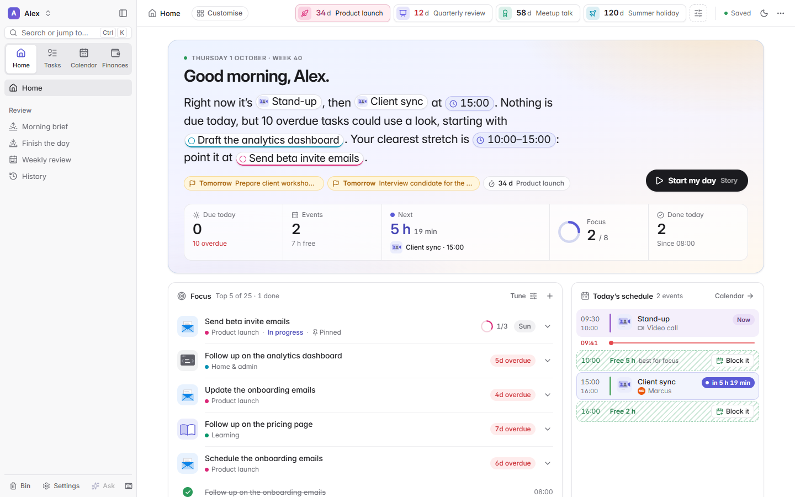
  </picture>
</p>

OpenDash puts your tasks, calendar, money, people, files and links together on
one page, with a short morning brief to start the day and a gentle review to
close it. It runs on your own computer: no account, no cloud, no npm packages,
and all of your data lives in one folder you own. When you want a hand, an
optional Claude assistant and a built-in MCP server let AI tools work with your
dashboard, on your terms.

> Every screenshot in this repository shows invented demo data (Alex, Priya,
> Northwind Labs and friends), the same kind you can load from the welcome
> screen to look around.

## Contents

- [Why OpenDash](#why-opendash)
- [Features](#features)
- [Quick start](#quick-start)
- [Connecting Claude (optional)](#connecting-claude-optional)
- [Privacy](#privacy)
- [Documentation](#documentation)
- [Roadmap](#roadmap)
- [Contributing](#contributing)
- [Licence](#licence)
- [Acknowledgements](#acknowledgements)

## Why OpenDash

- **Local-first.** A small Node.js server on `127.0.0.1` and one page in your
  browser. Nothing to sign up for, nothing hosted, and it runs on Windows,
  macOS and Linux.
- **Private by design.** Everything you own is plain files in one data folder
  on your computer, with automatic backups. No analytics, no telemetry, no
  update checks. The network is only used for features you switch on.
- **Calm.** One page that tells you what today looks like in a few sentences,
  what to focus on and where you need to be, instead of a wall of lists.
- **Works offline.** Tasks, the calendar view, Finances with CSV import,
  people, files and links, the brief and the stories all work without a
  connection. If the server stops, the page keeps your edits and saves them
  when it is back.
- **Zero dependencies.** Node.js 20 or newer is all it needs. No `npm install`,
  no database, no build tools to install.
- **Optional Claude superpowers.** Connect Claude Code (with your own Claude
  plan) for an assistant that proposes changes for you to approve, AI
  summaries, smart suggestions and read-only Gmail, Google Calendar and bank
  sync. Or let your own Claude use OpenDash through its MCP server.

## Features

### Home

Your day on one page: today in a few sentences with links to everything they
mention, the few tasks that matter now (**Focus**), today's schedule with its
free stretches, who you will see, what you are waiting on, this week, your
countdowns and your money at a glance. Click a Focus task to open it in place
and tick off its subtasks.

<p align="center">
  <picture>
    <source media="(prefers-color-scheme: dark)" srcset="docs/screenshots/home-focus-dark.png">
    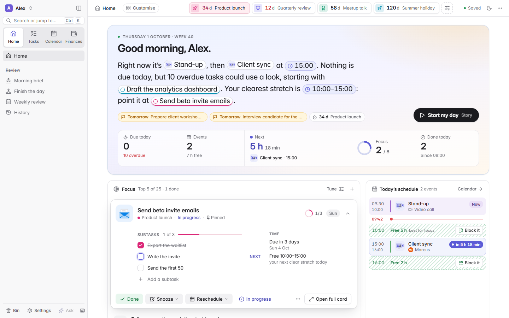
  </picture>
</p>

### Tasks

- **Streams** for the big areas of your life, plus priorities, tags, subtasks,
  people, notes, repeats, a planned day separate from the due date, and time
  estimates.
- **Today, Upcoming, All tasks, No date, Logbook, Wins** and a view per
  stream, tag and person, as a list or a board.
- **Quick add** in plain words, anywhere (press <kbd>Q</kbd>):
  `Send Alex the slides fri 3pm #work !p1 ~1h`.
- **Search with operators** (`#tag @person p1 is:open due:week`), bulk edits,
  a Bin, and undo and redo everywhere.
- Tasks and calendar events open in a roomy **centre card** (or a side panel,
  if you prefer).

<table>
  <tr>
    <td width="50%">
      <picture>
        <source media="(prefers-color-scheme: dark)" srcset="docs/screenshots/today-dark.png">
        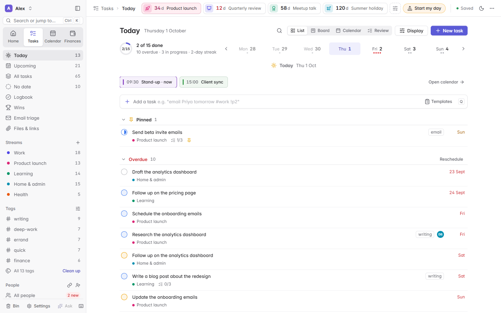
      </picture>
    </td>
    <td width="50%">
      <picture>
        <source media="(prefers-color-scheme: dark)" srcset="docs/screenshots/task-card-dark.png">
        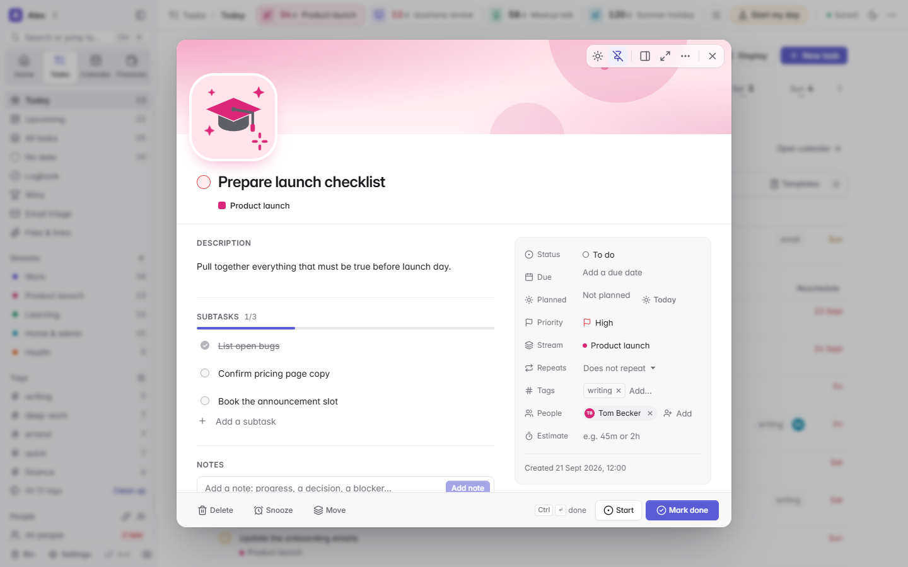
      </picture>
    </td>
  </tr>
</table>

### Calendar

Month, week, day and agenda views with your tasks, planned blocks and
countdowns next to your events. Drag a task onto the week to plan it, keep
your own notes and agenda on any event, and turn each calendar on or off.
Events come from Google Calendar through Claude, from any read-only calendar
source you add, or straight from an iCal link with no AI involved.

<p align="center">
  <picture>
    <source media="(prefers-color-scheme: dark)" srcset="docs/screenshots/calendar-week-dark.png">
    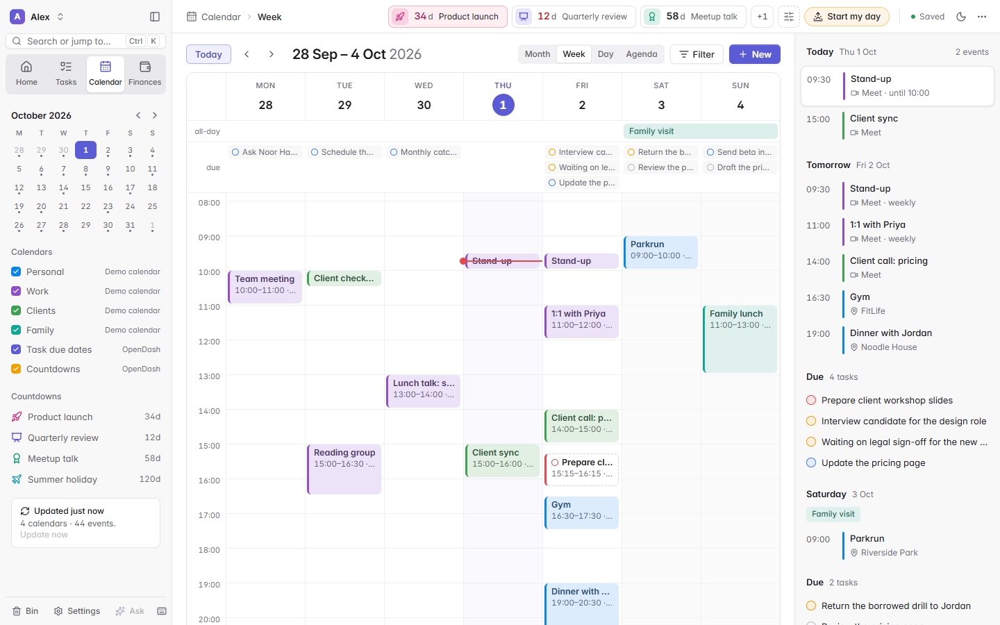
  </picture>
</p>

### Finances

Import your bank's CSV export (no connection needed) or sync read-only through
a bank connector. The **money brief** tells you how this pay cycle is going in
three sentences, what is safe to spend a day and which bills land before
payday. Then dig into spending, categories, merchants, cash flow, recurring
payments, budgets and every transaction. Finance data never enters your task
data; once it is in, AI features and the MCP server only ever see totals.

<p align="center">
  <picture>
    <source media="(prefers-color-scheme: dark)" srcset="docs/screenshots/finance-overview-dark.png">
    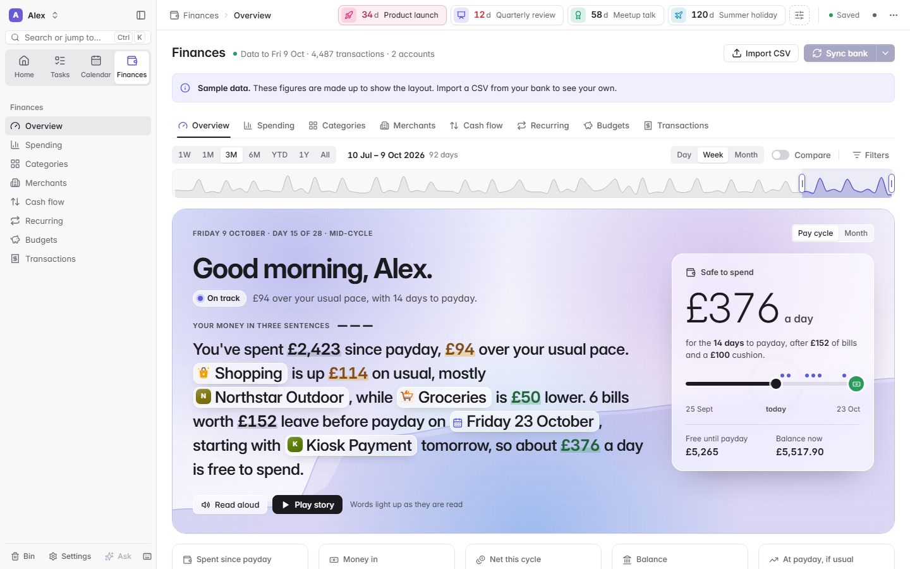
  </picture>
</p>

<table>
  <tr>
    <td width="50%">
      <picture>
        <source media="(prefers-color-scheme: dark)" srcset="docs/screenshots/finance-categories-dark.png">
        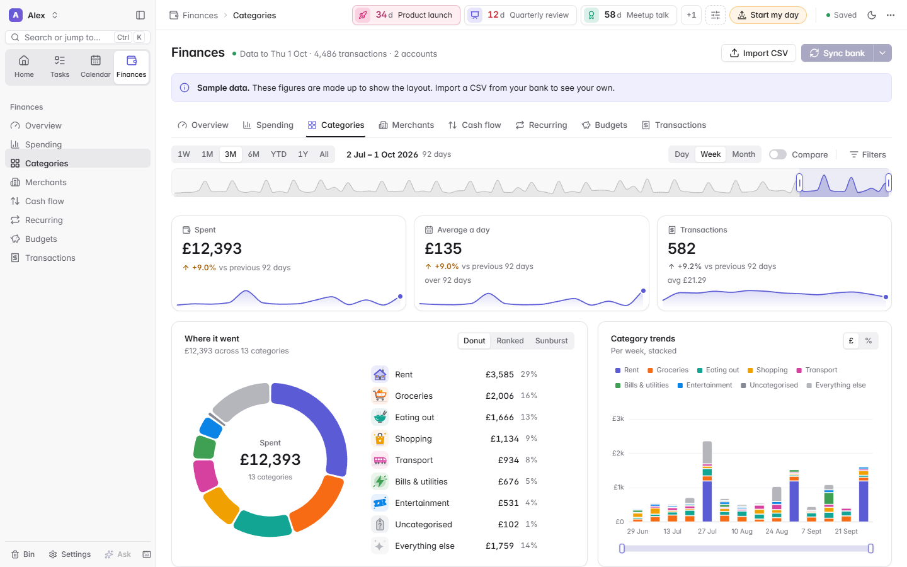
      </picture>
    </td>
    <td width="50%">
      <picture>
        <source media="(prefers-color-scheme: dark)" srcset="docs/screenshots/finance-cashflow-dark.png">
        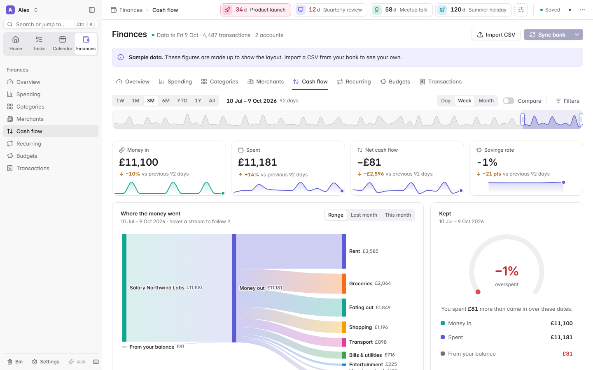
      </picture>
    </td>
  </tr>
</table>

### Morning brief, Finish the day and the Weekly review

**Start my day** opens your day as a full-screen story: the day in three
sentences, read aloud by your browser's speech voices, with scenes for your
events, the people you will see and the tasks that matter. **Finish the day**
recaps what you did, rolls over what slipped and picks tomorrow's top three.
The **Weekly review** walks through the past week and plans the next. Each one
also has a calm page version, and motion can be turned off.

<p align="center">
  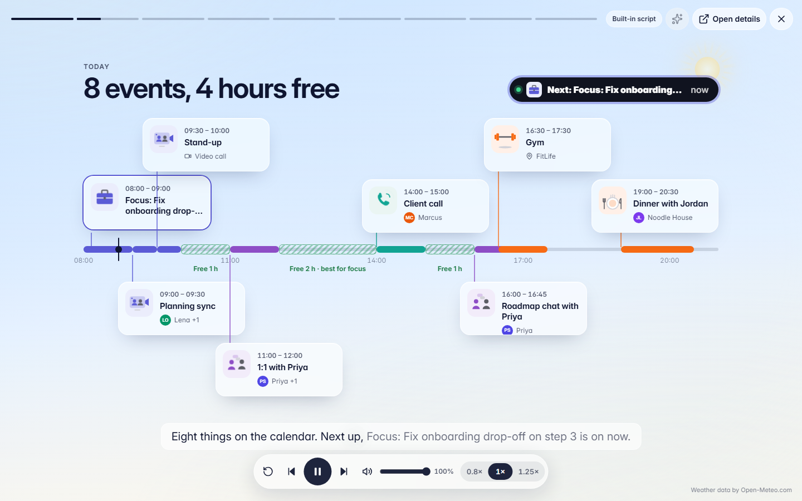
</p>

### People

Everyone you work with, with their role and organisation, notes, next meeting
and last contact from your calendar, and their open tasks split into *I owe
them* and *waiting on them*. Tasks link to people explicitly, through a tag,
or by a name in the title (OpenDash suggests the link).

<p align="center">
  <picture>
    <source media="(prefers-color-scheme: dark)" srcset="docs/screenshots/people-dark.png">
    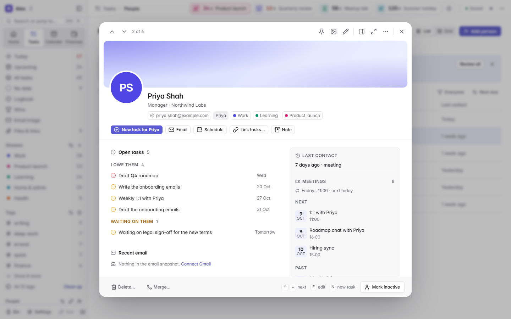
  </picture>
</p>

### Files & links

Attach folders, files, web links, GitHub repositories, pull requests and
issues, Google Drive files and code snippets to tasks, streams and people, then
open, reveal or explore them. Point **auto-linking** at your workspace folders
and it finds the folder, repository, meetings, emails, people and related
tasks each task belongs to: confident links are attached for you (with Undo),
the rest wait as suggestions. OpenDash only opens items you saved, and never
launches programs.

### The assistant

Press <kbd>Ctrl</kbd>+<kbd>J</kbd> and ask in plain words: *"What is due this
week?"*, *"Move everything for Acme to next Monday"*. The assistant looks
things up itself and **proposes** changes with a before-and-after preview;
nothing changes until you press **Apply**, and every change can be undone.
Text inside emails, invitations or bank data can never change your data on its
own. Needs Claude ([below](#connecting-claude-optional)).

### Its own MCP server

OpenDash ships a [Model Context Protocol](https://modelcontextprotocol.io)
server (84 tools) that explains itself to any model, so Claude Code, T3 Code
or Claude Desktop can read and change your tasks, people, tags and countdowns
from a chat. Safety rails are enforced by OpenDash, not left to the model: ISO
dates only, duplicate checks, previews for bulk and destructive changes, and
undo for everything. See [docs/MCP.md](docs/MCP.md).

### Make it yours

Rearrange Home like phone widgets: drag, resize, hide and add them back.
Right-click any stream, tag or person (or press <kbd>Shift</kbd>+<kbd>F10</kbd>)
to rename it or change its colour, symbol and shape everywhere at once, and
right-click a task in a list, on a board, in the calendar or in Focus for its
menu. Light, dark and automatic
themes, and <kbd>Ctrl</kbd>+<kbd>K</kbd> for everything else.

<table>
  <tr>
    <td width="50%">
      <picture>
        <source media="(prefers-color-scheme: dark)" srcset="docs/screenshots/home-customise-dark.png">
        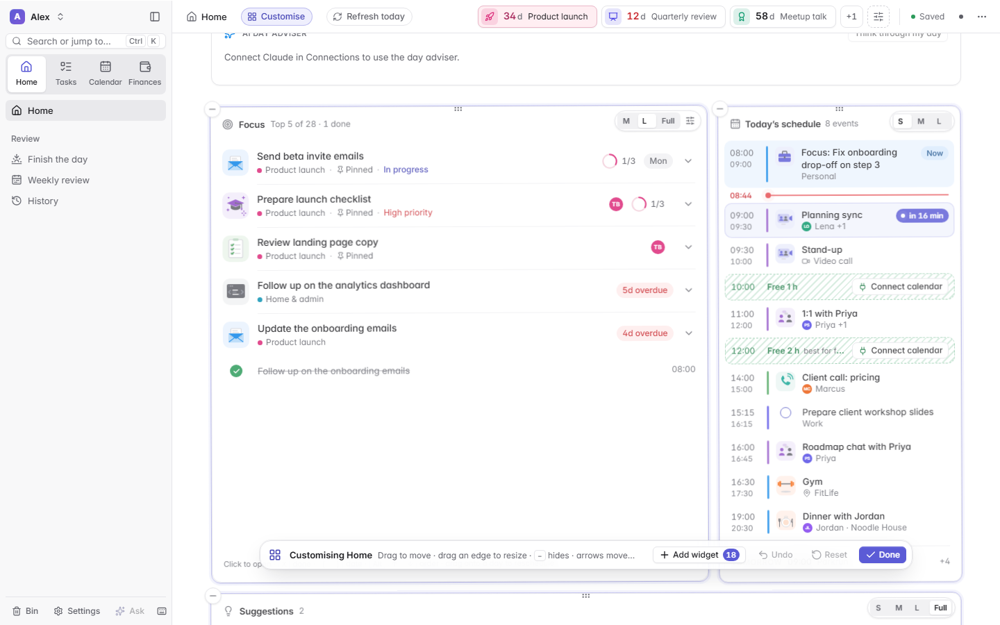
      </picture>
    </td>
    <td width="50%">
      <picture>
        <source media="(prefers-color-scheme: dark)" srcset="docs/screenshots/customise-menu-dark.png">
        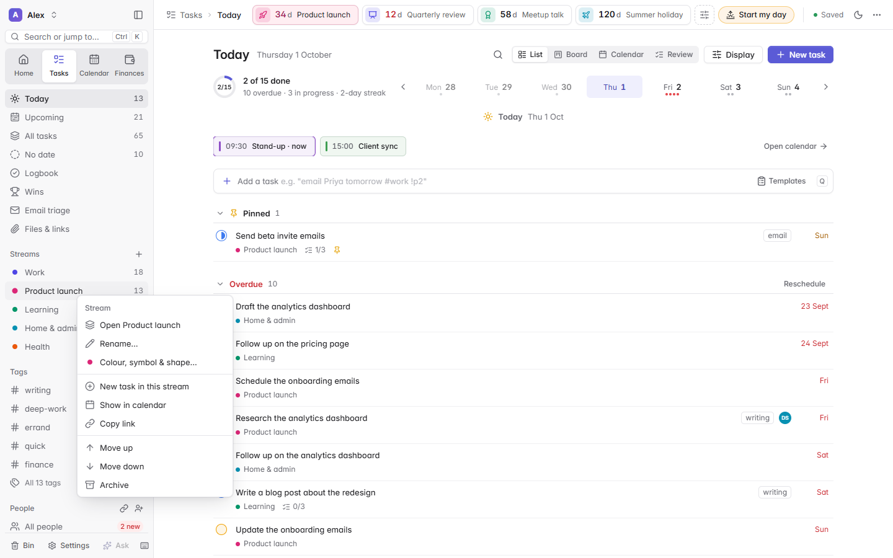
      </picture>
    </td>
  </tr>
</table>

### Server control

**Settings > Server** shows the local server's status and lets you restart it,
rebuild and restart it after an update, read its log or stop it. A small
supervisor starts it again if it crashes. When the server is not running,
the page says so, keeps your edits and saves them when it is back. On Windows
you can opt in to starting OpenDash when you log in (off by default).

<table>
  <tr>
    <td width="66%">
      <picture>
        <source media="(prefers-color-scheme: dark)" srcset="docs/screenshots/settings-server-dark.png">
         Server: status, restart, log and start-up options" src="docs/screenshots/settings-server-light.png">
      </picture>
    </td>
    <td width="34%">
      <picture>
        <source media="(prefers-color-scheme: dark)" srcset="docs/screenshots/phone-home-dark.png">
        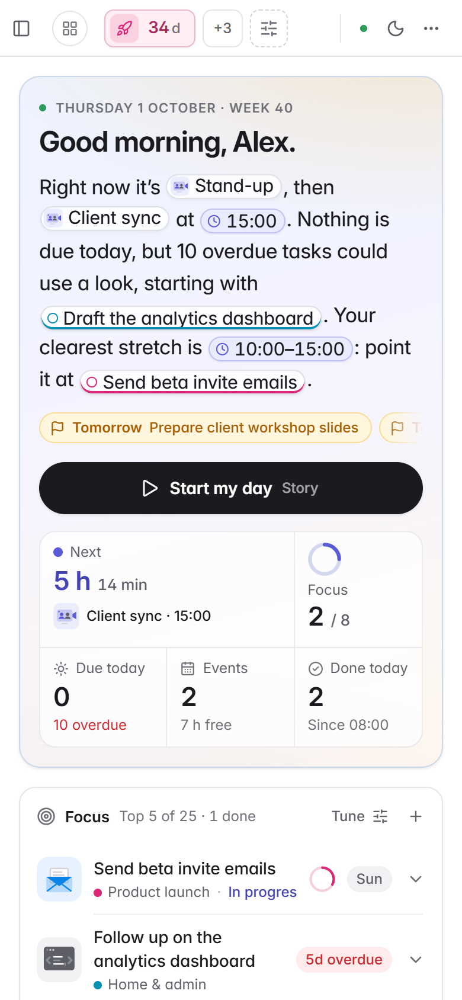
      </picture>
    </td>
  </tr>
</table>

## Quick start

1. **Download** `opendash-v<version>.zip` from the
   [latest release](https://github.com/mahdi1190/opendash/releases/latest)
   and unzip it somewhere of your own (a path with spaces is fine).
2. **Install [Node.js](https://nodejs.org) 20 or newer** (the LTS version).
   Check with `node -v`.
3. **Run the launcher** in the unzipped folder:
   - **Windows**: double-click `start-opendash.bat`.
   - **macOS and Linux**: in a terminal, `sh start-opendash.sh`.

Your browser opens <http://localhost:4173>. A short welcome asks for your name,
region and a starting set of streams; choose **Load demo data** if you would
like to look around first. Keep the launcher window open while you use
OpenDash; closing it stops the server.

The launcher checks your Node version, upgrades your data folder if a new
version needs it (after backing it up), builds the page and starts the server.
Options such as `--port 4300`, `--data-dir <folder>` and `--no-open` are in
the [install guide](docs/INSTALL.md#launcher-options), with step-by-step
instructions for each system, updating and uninstalling.

<details>
<summary>Running from a clone instead</summary>

```sh
git clone https://github.com/mahdi1190/opendash.git
cd opendash
sh start-opendash.sh        # or start-opendash.bat on Windows
```

The release zip is the version that has been built, scanned and tested for
each release; a clone of `main` may be ahead of it.

</details>

## Connecting Claude (optional)

OpenDash works fully without AI. To switch on the smart parts, open
**Connections** (Settings > Connections):

1. **Link Claude** checks for local Claude Code first, installs it only if
   missing, opens browser sign-in if needed, and adds the OpenDash tools.
   Claude Desktop and relay hosting are unnecessary. AI usage follows your
   selected Claude subscription or API account; a free claude.ai account alone
   does not include Claude Code. [Setup details](docs/CONNECTIONS.md#claude-claude-code-on-this-computer).
2. **Add connectors** in claude.ai (Settings > Connectors) for Gmail, Google
   Calendar or your bank, then press *Check again*. OpenDash only ever lets
   them use **read** tools.
3. **Use AI inside OpenDash**: once linked, use the dashboard's assistant,
   task chat, smart suggestions and AI summaries. They use your local Claude
   sign-in; no separate browser session is required.
4. **Optional browser chat**: press **Open connected Claude** to start an
   official Remote Control terminal and open `claude.ai/code`. Finish any
   terminal confirmations, then select **OpenDash** in the browser. Keep the
   terminal running. Remote Control requires an eligible Claude subscription;
   ordinary Claude website chats do not inherit this local tool connection.

For optional **ordinary Claude website access**, an operator-configured advanced relay card prepares a connection
through the shared OpenDash relay and opens Claude with the connector details
filled in. Sign in, confirm the connector and approve its matching code in your
local dashboard. Claude
Desktop and your own Cloudflare account are unnecessary. Keep OpenDash running;
selected requests and responses pass through the relay, while your dashboard
files stay on your computer. The shared relay is not enabled in this release;
its public deployment still needs verification. See [the relay guide](docs/dev/HOSTED_RELAY.md).

The **Microsoft** card supports personal Outlook/Hotmail and work/school
Microsoft 365 through Microsoft's sign-in page, with read-only email and
calendar permissions. A deployment needs a registered public Microsoft app
before sign-in is available; see [Microsoft setup](docs/dev/MICROSOFT_CONNECT.md).

Details: [docs/CONNECTIONS.md](docs/CONNECTIONS.md) and
[docs/MCP.md](docs/MCP.md).

## Privacy

OpenDash has no cloud, no account, no analytics and no telemetry, and the
server only listens on `127.0.0.1`. Your data is plain files in one folder on
your computer, and it is never sent to the OpenDash project. The network is
only used by features you switch on, and only to reach the service that
feature names: for example Claude through your own Claude Code sign-in (and,
through it, the read-only connectors you add), an iCal address you paste, or
Open-Meteo for the weather. One thing happens by itself: if Claude Code is
already installed and signed in on your computer, OpenDash finds it and counts
Claude as connected, so it sends Claude Code a tiny test prompt (none of your
data) when the server starts, and writes the Morning brief's summary and story
scripts with Claude once a day (Settings > Morning brief > *AI summary* turns
those off). [docs/PRIVACY.md](docs/PRIVACY.md) lists exactly what is
stored where and what leaves your computer, and when. Found a security
problem? Please report it privately, as described in
[SECURITY.md](.github/SECURITY.md).

## Documentation

| Guide | What is in it |
|---|---|
| [Install](docs/INSTALL.md) | Windows, macOS and Linux, the first run, options, updating, uninstalling |
| [Using OpenDash](docs/USAGE.md) | a tour of every area, quick add and keyboard shortcuts |
| [Connections](docs/CONNECTIONS.md) | Claude Code, Gmail, Google Calendar, banks, iCal links and data sources |
| [MCP server](docs/MCP.md) | using OpenDash from Claude Code, T3 Code or Claude Desktop, and every tool |
| [Privacy](docs/PRIVACY.md) | what is stored where, and when anything leaves your computer |
| [FAQ](docs/FAQ.md) | common questions |
| [Architecture](docs/ARCHITECTURE.md) | how the code is organised, for contributors |
| [Changelog](docs/CHANGELOG.md) | what changed in each release |

## Roadmap

OpenDash 2.0.0 is the first public release. Local-first stays the default;
everything involving the cloud, accounts or other devices will be optional,
opt-in and end-to-end encrypted. The full plan is in
[docs/ROADMAP.md](docs/ROADMAP.md), and planned releases are tracked as
[milestones](https://github.com/mahdi1190/opendash/milestones).

- **v2.1, "Do more from Home" (in progress):** a calendar that works like
  Google Calendar, one-click recommendations, 16 new Home widgets, the morning
  brief on Home, a money story, travel and time zones, rebuilt People, and
  animations everywhere.
- **v2.2, "Alive" (the animation update):** a large animation library with a
  new look every day, visual themes, seasonal skies, a UK counties pack,
  achievements and an animated "Year in OpenDash".
- **v3.0, "OpenDash Everywhere" (planned):** a phone app (installable web app,
  then native), end-to-end encrypted sync between your devices
  (self-hosted, your own cloud storage, or an optional hosted service), app
  lock with passkeys, encryption at rest, and push notifications.

Ideas and votes are welcome in
[Discussions](https://github.com/mahdi1190/opendash/discussions).

## Contributing

Bug reports, ideas, documentation fixes and pull requests are all welcome.
Start with the [contributing guide](.github/CONTRIBUTING.md): it covers the
development setup (there is nothing to install), the tests, the coding
conventions and how to add a widget, a view or a data source. Please follow
the [code of conduct](.github/CODE_OF_CONDUCT.md), and use demo data in every
screenshot and bug report. Questions are best asked in
[Discussions](https://github.com/mahdi1190/opendash/discussions); see
[SUPPORT.md](.github/SUPPORT.md).

## Licence

OpenDash is free and open source under the [MIT licence](LICENSE). The bundled
font, icons and charting library keep their own licences: see
[THIRD_PARTY_NOTICES.md](THIRD_PARTY_NOTICES.md).

## Acknowledgements

- [Apache ECharts](https://echarts.apache.org) for the charts in Finances
  (Apache 2.0).
- [Inter](https://rsms.me/inter/) by The Inter Project Authors, the interface
  font and the letterforms of the wordmark (SIL Open Font License 1.1).
- [Lucide](https://lucide.dev) for the icons (ISC; parts from Feather, MIT).
- [Open-Meteo](https://open-meteo.com) for free weather data with no account
  or key.
- Claude Code and the
  [Model Context Protocol](https://modelcontextprotocol.io), which the
  optional AI features are built on.
- [Keep a Changelog](https://keepachangelog.com),
  [Semantic Versioning](https://semver.org) and the
  [Contributor Covenant](https://www.contributor-covenant.org).
