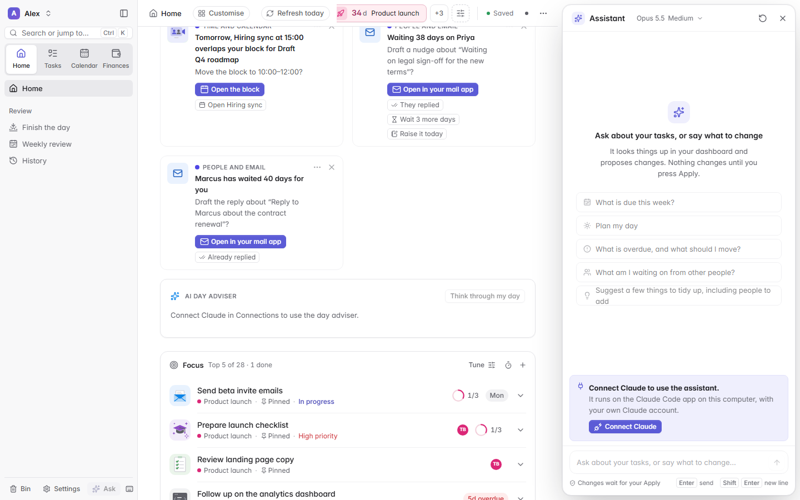

  <picture>
    <source media="(prefers-color-scheme: dark)" srcset="assets/brand/lockup-dark.svg">
    
  </picture>

<strong>Plan your day. Keep your data.</strong> 
A calm, local-first dashboard for your tasks, calendar, money and people, running on your own computer.

  
  
  
  
  

  <a href="https://github.com/mahdi1190/opendash/releases/latest"><strong>Download</strong></a> ·
  <a href="#quick-start">Quick start</a> ·
  <a href="#features">Features</a> ·
  <a href="docs/README.md">Documentation</a> ·
  <a href="docs/PRIVACY.md">Privacy</a> ·
  <a href="docs/CHANGELOG.md">Changelog</a>

  <picture>
    <source media="(prefers-color-scheme: dark)" srcset="docs/screenshots/home-dark.png">
    
  </picture>

OpenDash puts your tasks, calendar, money and people on one page, with a short
morning brief to start the day. No account, no cloud, no npm packages: a small
Node.js server on your computer and one folder of data that is yours.

> Every screenshot shows invented demo data, the same kind you can load from
> the welcome screen to look around.

## Features

### Home and the morning brief

Today in a few sentences, the tasks that matter now (**Focus**), your schedule
and its free stretches, the weather, countdowns and ideas for the day.
**Play my morning** opens the day as a full-screen story, read aloud;
**Finish the day** and the **Weekly review** close the loop.

Stories use free browser speech by default. In **Settings > Home and stories**,
you can connect your own **ElevenLabs** API key, choose an eligible voice, and
use economical Flash narration or expressive Eleven v3. The selected voice
narrates every spoken moment by default; the optional highlights setting uses
the browser voice for supporting moments to save allowance. Claude writes the
script with tone, pacing and pause cues when connected. Saved audio replays
without generating it again; a monthly character cap and browser fallback
keep stories working when the allowance runs out. Clips prepare before the
intro starts, with progress on the opening screen; the playing story keeps
its prepared words, and a later Claude rewrite is offered for replay.
ElevenLabs receives the
words you choose to narrate. Its free plan has voice and noncommercial-use
restrictions; your own account's allowance applies.

### Tasks

Streams, priorities, tags, subtasks, people, repeats, estimates and a planned
day separate from the due date. List or board views, quick add in plain words
(<kbd>Q</kbd>: `Send Alex the slides fri 3pm #work !p1 ~1h`), search with
operators, a Bin, and undo everywhere.

<table>
  <tr>
    <td width="50%">
      <picture>
        <source media="(prefers-color-scheme: dark)" srcset="docs/screenshots/task-card-dark.png">
        
      </picture>
    </td>
    <td width="50%">
      <picture>
        <source media="(prefers-color-scheme: dark)" srcset="docs/screenshots/calendar-week-dark.png">
        
      </picture>
    </td>
  </tr>
</table>

### Calendar

Month, week, day and agenda views with tasks, planned blocks and countdowns
beside your events. Drag a task onto the week to plan it. Events come from
Google Calendar through Claude, a read-only calendar source, or a plain iCal
link with no AI involved.

### Finances

**Connections > Money** brings every bank and wallet into one place:
**Aureli** (via Claude), **Plasma One** (a public wallet address),
**Monzo** directly, other UK and EU banks through **Enable Banking**, or a
**CSV** export with no connection at all. Every connector is read-only by
construction and credentials never leave your computer. Then the money brief
tells you what is safe to spend, with spending, categories, cash flow,
recurring payments and budgets behind it.

<table>
  <tr>
    <td width="50%">
      <picture>
        <source media="(prefers-color-scheme: dark)" srcset="docs/screenshots/connections-money-dark.png">
         Money: Aureli, Plasma One, Monzo and Enable Banking side by side (demo data)" src="docs/screenshots/connections-money-light.png">
      </picture>
    </td>
    <td width="50%">
      <picture>
        <source media="(prefers-color-scheme: dark)" srcset="docs/screenshots/finance-overview-dark.png">
        
      </picture>
    </td>
  </tr>
</table>

### Stories and animations with the live sky

Openings and scenes for places around the world, drawn on a fast canvas
engine, that follow the real sky where you are: sun, moon, season and weather.
**Settings > Animations** has a searchable gallery with previews for dawn, day,
dusk and night. Motion can be reduced or switched off.

### The assistant and MCP

Press <kbd>Ctrl</kbd>+<kbd>J</kbd> and ask in plain words. The optional Claude
assistant **proposes** changes with a preview; nothing changes until you press
**Apply**, and everything can be undone. OpenDash also ships its own
[MCP server](docs/MCP.md), so Claude Code, T3 Code or Claude Desktop can work
with your tasks, people and countdowns, with the safety rails enforced by
OpenDash.

<table>
  <tr>
    <td width="50%">
      <picture>
        <source media="(prefers-color-scheme: dark)" srcset="docs/screenshots/animations-dark.png">
         Animations: the Dallas skyline at dusk with time-of-day previews" src="docs/screenshots/animations-light.png">
      </picture>
    </td>
    <td width="50%">
      <picture>
        <source media="(prefers-color-scheme: dark)" srcset="docs/screenshots/assistant-dark.png">
        
      </picture>
    </td>
  </tr>
</table>

Also: People with *I owe them* and *waiting on them*, files and links attached
to tasks with auto-linking, a customisable Home, light and dark themes, and
<kbd>Ctrl</kbd>+<kbd>K</kbd> for everything. The full tour is in
[docs/USAGE.md](docs/USAGE.md).

## Local-first and private

- **Your data stays on your computer**, as plain files in one folder, with
  automatic backups. The server only listens on `127.0.0.1`.
- **No account, no cloud, no analytics, no telemetry.** Nothing is ever sent to
  the OpenDash project.
- **The network is only used by features you switch on**, and only to reach
  the service that feature names (Claude, a bank, an iCal link, the weather).
- **Works offline**: tasks, the calendar view, Finances with CSV, people, the
  brief and the stories all work without a connection.

[docs/PRIVACY.md](docs/PRIVACY.md) lists exactly what is stored where and when
anything leaves your computer. Security problems: please report them
privately, as described in [SECURITY.md](.github/SECURITY.md).

## Quick start

You need [Node.js](https://nodejs.org) 20 or newer (the LTS version).

1. **Download** `opendash-v<version>.zip` from the
   [latest release](https://github.com/mahdi1190/opendash/releases/latest)
   and unzip it.
2. **Run** `start-opendash.bat` (Windows, double-click) or
   `sh start-opendash.sh` (macOS and Linux).
3. **Open** <http://localhost:4173> (the launcher opens it for you), then
   follow the short welcome, or choose **Load demo data** to look around.

Keep the launcher window open while you use OpenDash. Options, per-system steps
and uninstalling are in the [install guide](docs/INSTALL.md).

## Updates

**Settings > Updates > Check for updates** asks GitHub for the newest release
(nothing about you is sent), shows what is new, and **Update** installs it: the
zip is verified against its published SHA-256, the replaced files are backed
up and the server restarts. A once-a-day check is available and off by default.

## Documentation

| Guide | What is in it |
|---|---|
| [Install](docs/INSTALL.md) | Windows, macOS and Linux, options, updating, uninstalling |
| [Using OpenDash](docs/USAGE.md) | a tour of every area, quick add and keyboard shortcuts |
| [Connections](docs/CONNECTIONS.md) | Claude Code, Gmail, Google Calendar, banks, iCal links |
| [MCP server](docs/MCP.md) | using OpenDash from Claude Code, T3 Code or Claude Desktop |
| [Privacy](docs/PRIVACY.md) | what is stored where, and when anything leaves your computer |
| [FAQ](docs/FAQ.md) | common questions |
| [Architecture](docs/ARCHITECTURE.md) | how the code is organised, for contributors |
| [Changelog](docs/CHANGELOG.md) | what changed in each release |

## Roadmap

Local-first stays the default; anything involving the cloud, accounts or other
devices will be optional, opt-in and end-to-end encrypted. Coming up: more
animation packs and moments across the app, and later **OpenDash Everywhere**,
a phone app with encrypted sync between your devices. The plan is in
[docs/ROADMAP.md](docs/ROADMAP.md); ideas are welcome in
[Discussions](https://github.com/mahdi1190/opendash/discussions).

## Contributing

Bug reports, ideas, documentation fixes and pull requests are all welcome.
Start with the [contributing guide](.github/CONTRIBUTING.md) (there is nothing
to install) and the [code of conduct](.github/CODE_OF_CONDUCT.md), and please
use demo data in every screenshot and bug report. Questions go to
[Discussions](https://github.com/mahdi1190/opendash/discussions); see
[SUPPORT.md](.github/SUPPORT.md).

## Licence

OpenDash is free and open source under the [MIT licence](LICENSE). The bundled
font (Inter), icons (Lucide) and charting library (Apache ECharts) keep their
own licences: see [THIRD_PARTY_NOTICES.md](THIRD_PARTY_NOTICES.md).
