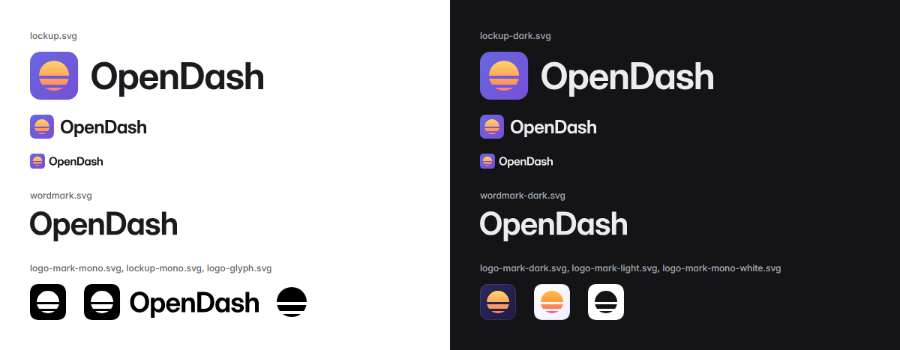
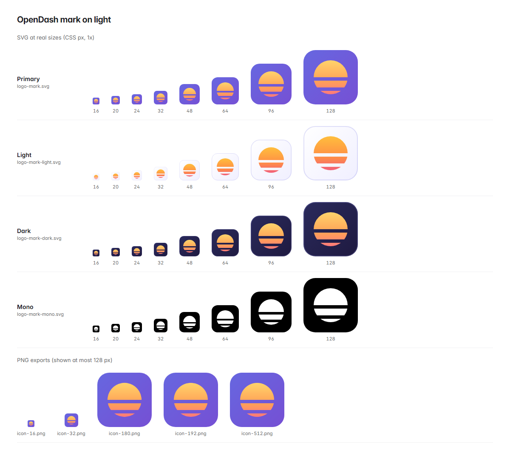
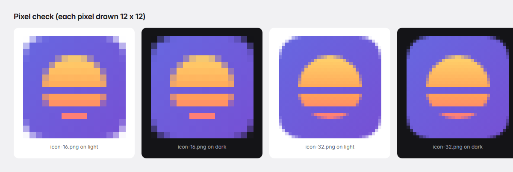
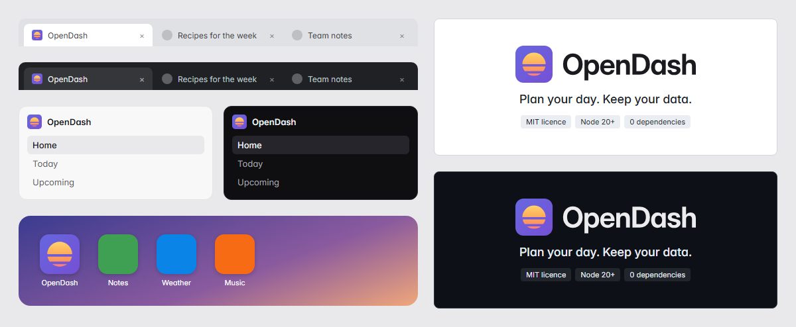
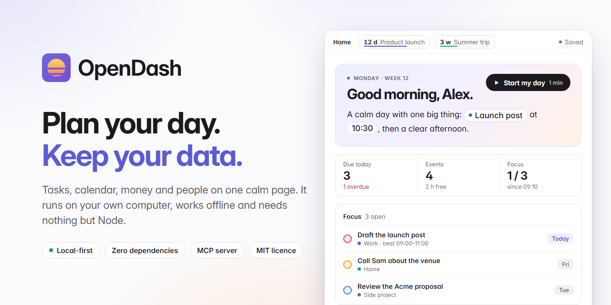

# OpenDash brand

Everything you need to show OpenDash: the logo, the wordmark, the colours, the
words, and what to put in the GitHub repository settings. Every file in this
folder is made by one script, [`tools/release-brand.mjs`](../../tools/release-brand.mjs),
so the logo never drifts between sizes.



## The name

**OpenDash**: one word, capital O, capital D.

- *Open* because it is open source, your data sits in an open folder you own,
  and the day ahead is open.
- *Dash* because it is a dashboard, and because the logo's sun is cut into dashes.

In code, URLs, folders and package names, write `opendash`. Please don't write
"Open Dash", "Opendash" or "OPENDASH".

## The mark

A sun rising inside a rounded card: the day ahead, on one page. The horizon
cuts the sun into three dashes (a dome, a dash and a sliver). The gaps keep it
light and open, and they are the "Dash" in the name.

- **Grid.** A 64-unit tile with a 14-unit corner radius. The sun is centred at
  (32, 32) with a radius of 20, and the two cuts run from y = 32 to 36 and from
  y = 44 to 48.
- **Pixel-fitted.** Every straight edge lands on a whole pixel at 16, 32, 48
  and 64 px, so the cuts stay sharp at 16 px instead of blurring into the tile.
- **Favicon hinting.** `favicon.svg` swaps the bottom sliver for a straight bar
  16 units wide (exactly 4 x 1 px at 16 px), so it reads cleanly in a browser tab.
- **Safe for masks.** The sun sits inside the central 80 % circle, so Android's
  maskable icons and iOS's rounded squares never clip it.





## Files

### Logo mark

| File | What it is | Use it for |
|---|---|---|
| `logo-mark.svg` | **Primary.** Indigo tile, warm sun | The default, on any background from white to black |
| `logo-mark-light.svg` | White tile, faint indigo edge, deeper sun | Light pages where a solid indigo block feels too heavy |
| `logo-mark-dark.svg` | Night-indigo tile | Dark pages where the primary feels too bright |
| `logo-mark-mono.svg` | One colour (`currentColor`), the sun cut out of the tile | One-colour printing; inherits the text colour when inlined |
| `logo-mark-mono-white.svg` | The same, in white | Photos and dark solid colours |
| `logo-mark-square.svg` | The primary with square corners | Platforms that round the corners themselves (app stores, launchers) |
| `logo-glyph.svg` | The sun on its own, one colour, no tile | Tiny inline use next to text, where a tile would be too heavy |
| `favicon.svg` | The primary, pixel-hinted for 16 px | Browser tabs and bookmarks |

### Wordmark and lockups

The wordmark is outlines, not text, so it looks the same everywhere with no
font installed.

| File | Colour | Use it for |
|---|---|---|
| `wordmark.svg` | Ink `#1b1b1f` | The name alone, on light |
| `wordmark-dark.svg` | Mist `#ececef` | The name alone, on dark |
| `wordmark-mono.svg` | `currentColor` | One-colour use |
| `lockup.svg` | Mark + ink wordmark | README headers, slides, anywhere the name and logo appear together, on light |
| `lockup-dark.svg` | Mark + mist wordmark | The same, on dark |
| `lockup-mono.svg` | All `currentColor` | One-colour use |

### Bitmaps

All PNGs are rendered by headless Chrome from the SVGs above, then stripped of
every metadata chunk (no text, time, colour profile or EXIF): they contain only
`IHDR`, `IDAT` and `IEND`.

| File | Size | Notes |
|---|---|---|
| `png/icon-16.png` | 16 x 16 | From `favicon.svg`; transparent corners |
| `png/icon-32.png` | 32 x 32 | Transparent corners |
| `png/icon-180.png` | 180 x 180 | Transparent corners |
| `png/icon-192.png` | 192 x 192 | Web app manifest |
| `png/icon-512.png` | 512 x 512 | Web app manifest, large previews |
| `png/apple-touch-icon.png` | 180 x 180 | Opaque, square corners (iOS rounds them) |
| `png/icon-maskable-512.png` | 512 x 512 | Opaque, square corners, for `"purpose": "maskable"` |
| `favicon.ico` | 16, 32, 48 | For older browsers and Windows shortcuts |
| `social-preview.png` | 1280 x 640 | The GitHub repository card (see below) |

### Sources and previews

- `src/social-preview.html` is the social card. Everything in its mock window
  is made up (Alex, Sam, Acme, a product launch): keep it that way.
- `src/wordmark-glyphs.json` holds the outlines of the eight letters, taken from
  Inter (see [Credits](#licence-and-credits)).
- `preview/` holds review sheets: the mark at every size on light and dark,
  a pixel check, the lockups, and the logo in context (browser tabs, a sidebar,
  a phone home screen, a README header). They are for checking the artwork,
  not for use as assets.



## Colour

The colours come from the app's own design tokens
([`src/styles/00-tokens.css`](../../src/styles/00-tokens.css)), so the logo
and the app feel like one thing.

### In the mark

| Name | Value | Where |
|---|---|---|
| Indigo | `#5b5bd6` | The app's accent (`--accent`, light theme). Links, primary buttons, highlights |
| Indigo ink | `#4343b4` | `--accent-ink`. Indigo text on pale indigo surfaces |
| Tile | `#6767e0` to `#7650d4` | The primary tile, top-left to bottom-right |
| Sun | `#ffd36b` to `#ffa257` (60 %) to `#ff7a7a` | Top to bottom. The one warm thing on the page |
| Sun on light | `#ffbe3d` to `#ff8f45` (60 %) to `#f2607a` | The light variant: a little deeper, so it holds on white |
| Light tile | `#ffffff` to `#f0efff`, edge `#5b5bd6` at 18 % | `logo-mark-light.svg` |
| Night tile | `#2a2a5c` to `#1f1a40`, edge `#a9a9ff` at 22 % | `logo-mark-dark.svg` |

### Neutrals

| Name | Value | Where |
|---|---|---|
| Ink | `#1b1b1f` | Text on light (`--fg`); the wordmark on light |
| Mist | `#ececef` | Text on dark (`--fg`, dark theme); the wordmark on dark |
| Paper | `#ffffff` | Light background (`--bg`) |
| Night | `#141417` | Dark background (`--bg`, dark theme) |
| Muted | `#5d5e66` / `#a1a1aa` | Secondary text on light / dark (`--fg-muted`) |
| Soft indigo | `#efeffd` | Tinted surfaces and chips on light (`--accent-soft`) |
| Light indigo | `#a9a9ff` | Indigo text and links on dark (`--accent-ink`, dark theme) |

### Supporting colours

For diagrams and illustrations, borrow the app's own: green `#2b9a5a`,
amber `#e5a000`, red `#e5484d`, teal `#12a594`, violet `#8e4ec6` and
blue `#0b84e8`. Keep them small next to the indigo and the sun.

### Contrast

| Pair | Ratio | |
|---|---|---|
| Ink on Paper | 17.2 : 1 | Body text, AAA |
| Mist on Night | 15.6 : 1 | Body text, AAA |
| Indigo on Paper | 5.4 : 1 | Text and links, AA |
| White on Indigo | 5.4 : 1 | Button labels, AA |
| Light indigo on Night | 8.6 : 1 | Links on dark, AAA |
| Tile `#6767e0` on Paper / on Night | 4.6 : 1 / 4.0 : 1 | The mark stands out on both (3 : 1 needed for graphics) |

Indigo `#5b5bd6` on Night is only 3.4 : 1: on dark backgrounds use Light indigo
`#a9a9ff` for text. The sun colours are for the mark and illustrations, never
for text.

## Type

The app, the wordmark and the social card all use **Inter** (SIL Open Font
License 1.1), which ships with the repository in `vendor/fonts/`.

- **Wordmark:** Inter at weight 650 and optical size 32, with the single-storey
  *a* (`cv11`) the app uses, tracked to -0.022 em, then converted to outlines.
- **Headlines:** Inter 700, tracking about -0.03 em.
- **Body:** Inter 400 to 500, tracking -0.011 em.
- **Fallback:** the app's system stack, `ui-sans-serif, system-ui, -apple-system,
  "Segoe UI Variable Text", "Segoe UI", Roboto, "Helvetica Neue", Arial, sans-serif`.

Don't retype the wordmark in a font: use the SVG.

## Using the logo

**Do**

- Use the files as they are, at their own proportions.
- Leave clear space of at least a quarter of the mark's height on every side
  (16 units of the 64-unit tile). In a lockup, keep the built-in gap between
  the mark and the name.
- Use `favicon.svg` or `png/icon-16.png` below 24 px; they are tuned for it.
- Use the primary mark on photos or busy backgrounds: it brings its own tile.
- Use the mono files for one-colour printing, engraving or stickers.

**Minimum sizes:** the mark 16 px; a lockup 20 px tall; the wordmark alone
14 px tall.

**Please don't**

- Recolour the tile or the sun, or swap the gradients' direction.
- Add, remove or move the cuts in the sun.
- Rotate, stretch, outline, or add shadows, glows or bevels.
- Put the mark inside another shape, or set the wordmark in another font.
- Crowd the logo against other logos, or use it in a way that suggests the
  project endorses something it doesn't.

## Voice

Calm, plain and kind, like the app.

- Short sentences and everyday words. Say what something does, not how clever it is.
- British spelling, as in the app: *licence*, *colour*, *organise*.
- Write for everyone. No jargon in the first line, and no assumptions about
  anyone's job, family, culture, body or ability.
- Examples use made-up people and places: Alex, Sam, Acme. Never real people
  or real data, in words or in screenshots.

## Taglines

| | Tagline | Why |
|---|---|---|
| **1 (recommended)** | **Plan your day. Keep your data.** | Two promises in five words: what it does, and the principle behind it. Used on the social card |
| 2 | Your whole day, on one calm page. | Warmer and more visual; good as a README subtitle |
| 3 | Good mornings, on your own computer. | Playful; a nod to the morning brief and to local-first |

## Descriptions

**1. Recommended** (README introduction, release notes, directory listings):

> OpenDash is a calm, local-first dashboard for your day. Your tasks, calendar,
> money, people, files and links sit together on one page, with a short morning
> brief to start the day and a gentle review to close it. It runs on your own
> computer with Node.js 20 and nothing else: no account, no cloud, no npm
> packages, and all of your data lives in one folder you own. When you want a
> hand, an optional Claude assistant and a built-in MCP server let AI tools
> work with your dashboard, on your terms.

**2. Friendly** (social posts, a launch announcement):

> Think of OpenDash as a quiet home page for your life admin. Add a task in a
> second, see it next to your calendar, glance at this month's spending, and
> remember who you promised to call back. Everything stays on your machine, it
> works offline, and it is free and open source under the MIT licence.

**3. Technical** (developer communities, "awesome" lists):

> OpenDash is a single-user productivity dashboard that runs on localhost. The
> server is plain Node.js 20 with zero npm dependencies, the interface is
> vanilla JavaScript built into one HTML page, and all state is JSON in a
> gitignored data folder with automatic backups. It covers tasks, calendar,
> finances (CSV import), people, and files and links, and offers the same
> operations to AI tools through its own MCP server. MIT licensed; runs on
> Windows, macOS and Linux.

## GitHub repository settings

For `github.com/mahdi1190/opendash`, under **About** (the cog next to it on the
repository page) and **Settings > General**.

**Repository description** (GitHub allows 350 characters; this is 194):

```text
A calm, local-first dashboard for your day: tasks, calendar, money and people on one page. Runs on your own computer with Node.js and zero dependencies. Optional Claude assistant and MCP server.
```

**Topics** (20, GitHub's maximum):

```text
productivity dashboard personal-dashboard local-first self-hosted privacy offline-first task-manager todo planner calendar personal-finance personal-crm time-management mcp-server model-context-protocol claude nodejs zero-dependencies vanilla-js
```

**Website:** leave empty until there is a documentation site.

**Social preview:** Settings > General > Social preview > Edit > Upload an
image, and choose `social-preview.png` (1280 x 640, under 200 KB).



## Snippets

A README header that follows the reader's light or dark theme on GitHub:

```html
<p align="center">
  <picture>
    <source media="(prefers-color-scheme: dark)" srcset="assets/brand/lockup-dark.svg">
    
  </picture>
</p>
<p align="center"><strong>Plan your day. Keep your data.</strong></p>
```

Icons in an HTML page (copy the files next to the page, or adjust the paths):

```html
<link rel="icon" href="favicon.ico" sizes="32x32">
<link rel="icon" href="favicon.svg" type="image/svg+xml">
<link rel="apple-touch-icon" href="png/apple-touch-icon.png">
<link rel="manifest" href="site.webmanifest">
<meta name="theme-color" content="#5b5bd6">
```

And in a web app manifest:

```json
{
  "name": "OpenDash",
  "short_name": "OpenDash",
  "icons": [
    { "src": "png/icon-192.png", "sizes": "192x192", "type": "image/png" },
    { "src": "png/icon-512.png", "sizes": "512x512", "type": "image/png" },
    { "src": "png/icon-maskable-512.png", "sizes": "512x512", "type": "image/png", "purpose": "maskable" }
  ],
  "theme_color": "#5b5bd6",
  "background_color": "#ffffff"
}
```

## Rebuilding the assets

```sh
node tools/release-brand.mjs           # the SVGs, PNGs, favicon.ico, social card and previews
node tools/release-brand.mjs --svg     # the SVGs only (no browser needed)
node tools/release-brand.mjs --check   # fails if a committed SVG differs from the script
node --test tests/release-brand.test.mjs
```

- The PNGs need Chrome, Chromium or Microsoft Edge. The script finds them in
  the usual places; otherwise set `CHROME_PATH` to the browser's executable.
  It talks to the browser over the DevTools protocol with Node built-ins only.
- Change the mark's geometry and colours in `MARK` and `PALETTE` at the top of
  the script, never by hand in the SVGs: the tests fail if the two drift apart.
- The output is deterministic: the same browser version makes byte-identical files.

## Licence and credits

The OpenDash logo, wordmark and every file in this folder are part of the
repository and covered by its [MIT licence](../../LICENSE),
Copyright (c) 2026 Mahdi Ahmed.

The wordmark's letterforms come from [Inter](https://rsms.me/inter/) by The
Inter Project Authors, used under the SIL Open Font License 1.1
([`vendor/fonts/Inter-OFL.txt`](../../vendor/fonts/Inter-OFL.txt)).

You are welcome to use the logo to link to OpenDash, write about it or show it
in a talk. If you publish a fork as its own project, please give it its own
name and icon so people can tell the two apart.
