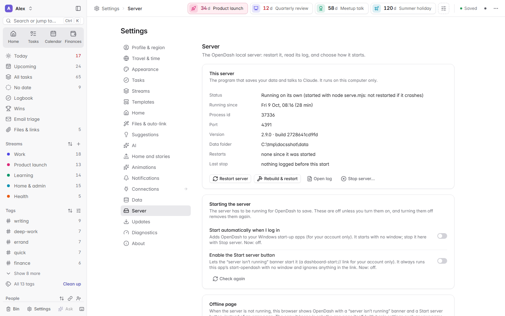

# Using OpenDash

A tour of OpenDash, area by area. Everything here works without any
connection; features that need Claude or an account are marked
**(needs Claude)** or **(needs a connection)** and stay visible but greyed
out until you connect them in **Connections**.

The screenshots show invented demo data, like the demo data you can load from
the welcome screen.

- [Getting around](#getting-around)
- [Home](#home)
- [Tasks](#tasks)
- [Quick add](#quick-add)
- [Calendar](#calendar)
- [Finances](#finances)
- [People and tags](#people-and-tags)
- [Files & links and auto-linking](#files--links-and-auto-linking)
- [Morning brief, Finish the day and the weekly review](#morning-brief-finish-the-day-and-the-weekly-review)
- [The assistant](#the-assistant)
- [Settings, backups and sharing](#settings-backups-and-sharing)
- [The server](#the-server)
- [Keyboard shortcuts](#keyboard-shortcuts)

## Getting around

- The **tiles** at the top of the sidebar switch between **Home**, **Tasks**,
  **Calendar** and **Finances**. The sidebar below them changes with the area:
  under Home it holds Home and the **Review** pages; the task views, streams,
  tags and people are under Tasks.
- The **top bar** shows where you are, your countdowns and widgets, and
  whether everything is saved.
- **Ctrl+K** (Cmd+K on a Mac) opens the **command palette**: type to jump to a
  view, run a command, find a task, person or file.
- Every view has its own address (`#view=calendar`, `#view=people`...), so
  browser Back and bookmarks work.
- Clicking the thing you are already on does nothing (except scrolling back to
  the top). The current item is highlighted wherever it appears.

## Home

Home is the landing page: a grid of widgets for today.


| Widget | What it shows |
|---|---|
| **Today** | the date, weather, your day in a few lines with links to what it names, deadlines and countdowns, a few numbers (due, events, next, Focus, done) and *Start my day* or *Finish the day* |
| **Focus** | the few tasks that matter most right now. Click a row to open it in place: its description, the whole checklist, folders, people and time, with *Done*, *Snooze*, *Reschedule* and *Open full card*. Drag a row onto a day in *This week* to move it |
| **Today's schedule** | today's events and planned tasks in order with a line for now, the next event, and free stretches of 45 minutes or more inside your working hours with *Block*, which books the time in your calendar |
| **Suggested links** | folders, meetings and people that auto-linking found for your tasks, to accept or reject (hidden until you add it) |
| **Waiting on** | tasks waiting on someone, oldest first, with *Nudge*, which drafts an email (it never sends one) |
| **Money** | spending today, this week and this month against your usual pace, with the latest payments **(needs Finances data)** |
| **People today** | who you meet today and why it matters, and who is waiting longest on you |
| **This week** | the next seven days: what is due, countdowns and events; drop a task on a day to move it |
| **Countdowns** | the dates you are counting down to, as big numbers |
| **Morning brief** | your day in three sentences, the shape of the day, what is due, Focus and money tiles, ideas; *Play* runs the story right in the panel (and full screen) |
| **Suggestions** | one-click ideas for your day (see below) |

Widgets with nothing to show stay out of the way until they have something.

More widgets wait in **Add widget** (Customise > Add widget), each with a
*New* badge until you have looked at it:

| Widget | What it does |
|---|---|
| **Quick capture** | type a task the quick way (`#tag @person tomorrow p1`), use a template, sort what you just added |
| **Fill the gap** | the free time until your next event and the task that fits it; *Block* puts it in your calendar |
| **Plan my day** | how much of today's free time your plans fill, a timeline you can drag tasks onto, and *Auto-plan* |
| **Meeting prep** | your next meeting with people: what you owe them, what you wait on, the agenda, a follow-up task, an email to everyone **(needs a calendar)** |
| **After meetings** | a note, a follow-up or a thank-you for each meeting that just ended **(needs a calendar)** |
| **Invites & clashes** | invitations to answer, clashes, back-to-back meetings, meetings with no link **(needs a calendar)** |
| **Needs reply** | emails from people waiting on you: make a task or write a reply draft **(needs a mailbox)** |
| **I owe** | what you promised whom, with *Today* and *Write* |
| **Catch up** | what slipped, and the tasks that keep moving |
| **Deadline runway** | will you make a countdown at your recent pace? (up to four) |
| **Smart list** | any search as a list or a board (up to six) |
| **Habits & routines** | your repeating tasks as streaks |
| **Launchpad** | pinned folders, links and snippets, one click away |
| **Payday & safe to spend** | how much a day is safe to spend until payday, the bills before it **(needs Finances data)** |
| **Daily note** | one running note per day; a line can become a task |
| **What changed** | what assistants, MCP clients and scripts changed today, with Undo |

**Every suggestion and widget button works the same way.** The main button
opens the normal editor already filled in (a new event, a task, an email
draft): change anything, then press *Save*. Nothing is saved before that. The
small **✓** beside it does the suggestion exactly as offered, at once, with
*Undo*. Blocking time always makes a calendar event (and plans the task for
that day); it never moves a deadline. Email is only ever saved as a **draft** in
Gmail: OpenDash cannot send email or move money.

**Tune Focus** with *Tune* on the Focus widget: how many tasks it shows (3 to
7), what it includes (overdue, pinned, in progress, planned for today, high
priority, and tasks due within 1, 3 or 7 days), which streams, *Reset order*,
and *Show N hidden* to bring back tasks you hid for today.

**Customise** (beside "Home" in the top bar, *Customise Home* at the foot of
the page, or press and hold a widget's title) lets you drag widgets, pick
their size (Small, Medium, Large or Full width, as each widget allows), change
a widget's options where it has them (Focus: *Tune*), hide them, add them back
with *Add widget*, or *Reset* the layout; *Done* or Esc finishes. With a
widget focused: Alt+arrows move it, + and - (or 1 to 4) resize it, Delete
hides it, and A opens *Add widget*. Settings > Home has the same switches for
the brief and suggestions panels, *Hide amounts* (blurs money until you point
at it) and your working hours.


**A new, empty Home** shows a welcome with three steps instead: add your first
task, connect a calendar, or load demo data to look around.

## Tasks

- **Streams** are the big areas of your life or work (for example Work,
  Projects, Personal). Each has its own colour, shape and symbol: right-click a
  stream, tag or person anywhere to customise or rename it.
- A task has a title, stream, priority (p1 to p3), due date and time, a
  **planned day** (when you will work on it, separate from the deadline), an
  estimate, tags, people, subtasks, notes and a history.
- **Views**: Today (due, overdue, planned for today and in progress), Upcoming,
  All tasks, No date, Logbook (done), Wins, by stream, by tag, by person, and
  the Bin. Show them as a **list** or a **board**, grouped and sorted as you
  like (*Display*).
- **Search and filter** with `/`, using operators: `#tag`, `@person`, `p1`,
  `is:done` (or `open`, `doing`, `wontdo`, `pinned`, `planned`), `due:today`
  (or `overdue`, `tomorrow`, `week`, `none`), `stream:work`, and `-word` to
  exclude a word.
- **Repeating tasks** move to their next date when you complete them.
  *Won't do* closes a task without counting it as done.
- Select several tasks for **bulk** changes: Ctrl+click (Cmd+click on a Mac)
  adds one, Shift+click a range, Shift+Up/Down extends the selection.
- **Undo** (Ctrl+Z) and redo work everywhere. Deleted tasks go to the **Bin**,
  where you can restore them.
- Right-click a task (in a list, on a board, in the calendar or in Focus on
  Home) for its menu.
- Tasks and calendar events open in the **centre card** (default) or the
  **side panel** (Settings > Tasks > *Open tasks and events in*); each has a
  button to switch to the other. Drag the card's edges to resize it, or press
  M to maximise it.


## Quick add

Press **Q** anywhere (or use the box at the top of a list) and type a task in
plain words. Chips show what was understood; click a chip to keep that part as
text instead.

| Type | Example | Meaning |
|---|---|---|
| a date at the end, or after "due"/"by" | `fri`, `tomorrow`, `next week`, `in 3 days`, `15 oct`, `2026-10-15` | due date |
| a time | `3pm`, `9:30am`, `14:00` | due time |
| a repeat | `every week`, `every 2 weeks`, `daily`, `every monday` | recurrence |
| `!p1` (or `p1` at the end) | `!p2` | priority |
| `#word` | `#work` | the stream if one has that name, otherwise a tag |
| `+word` | `+projects` | stream |
| `@name` | `@Sam` | link a person (a new name creates them) |
| `~time` | `~30m`, `~1.5h` | estimate |

Examples:

```
Send Alex the slides fri 3pm #work !p1 ~1h
Call the dentist #personal tomorrow 9am
Water the plants every week
Draft the Acme proposal due fri p2
```

Dates only count at the end or after "due"/"by", so a title such as
"Email Sam about the Sun article" stays as you typed it. Paste several lines
to add several tasks at once.

## Calendar

- **Month, week, day and agenda** views, with your tasks, planned blocks and
  countdowns next to your events.
- **Drag a task** onto the week or day view to plan it for a time slot. A
  planned slot (dashed, "Planned") keeps the task's deadline as it is.
- **Working hours** (Settings > Profile, 09:00–18:00 Monday to Friday unless
  you change them) decide what counts as free time on Home and in suggestions.
- **Writing to Google Calendar** **(needs a connection)**: create, move and
  edit events, answer invitations (always after a confirm), with *Undo*.
- Click an event for its details: join link, attendees (linked to People),
  related tasks, your own notes and agenda, *Create task*.
- The sidebar lists your calendars; switch each on or off, rename or recolour
  it (in OpenDash only).
- Calendars that belong to other people start switched off once your email
  addresses are in Settings > Profile & region. If you switch one on, it shows
  in the Calendar only: Home, the brief and the stories keep to your own day
  (your calendars and the events you are invited to, without the ones you
  declined).
- Events come from Google Calendar or any other calendar source you add,
  including **iCal links** **(needs a connection)**. *Update now* refreshes
  them. See [CONNECTIONS.md](CONNECTIONS.md).


## Finances

- **Import CSV** works with no connection at all: export transactions from
  your bank's website (any date range; overlaps are fine) and pick the file or
  drop it on the Finances page.
- **Sync bank** reads your transactions through a read-only bank connector
  **(needs a connection)**. Its menu also has *Full refresh*, *Import a CSV*,
  *Rebuild from inbox* (CSV files dropped in the finance inbox folder) and
  *Export all transactions*.
- Eight pages: **Overview**, **Spending**, **Categories**, **Merchants**,
  **Cash flow**, **Recurring**, **Budgets** and **Transactions**. The bar
  above them picks the dates (1W to All, or drag on the mini chart), Day,
  Week or Month buckets, *Compare* with the previous period, and *Filters*.
- **The Overview** opens with the **money brief**: how this pay cycle (or
  month) is going against your usual pace, "your money in three sentences",
  what is *safe to spend* a day until payday, the bills before payday, and
  the biggest movers. *Read aloud* reads it out; *Rewrite with Claude*
  **(needs Claude)** words the three sentences from your totals, and every
  number is checked against them. Below it, *More detail* follows the dates in
  the bar: spending over time, where it went, top merchants and **Worth a
  look** (possible duplicates, unusually large payments, price rises, new
  merchants, categories that went up).
- Click a category, merchant, bar or day to filter everything by it; the chip
  or Esc clears it.
- A wrong category? Change it once for that merchant; you can undo it.
- **Play story** (Overview) plays a short, read-aloud recap of the month or
  week: spent against usual, the top category, your top places, the biggest
  one-off, bills ahead, what you kept and a few fun facts. Its numbers are the
  Overview's own.

Finance data never enters the task state. *Sync bank* works through Claude,
so the transactions it fetches pass through Claude on their way in (a CSV
import never leaves your computer); after that, models see totals only:
never single transactions through the MCP server, and the money brief's
rewrite gets totals and the next few bills only. See [PRIVACY.md](PRIVACY.md).


## People and tags

- **People** holds the people (and organisations or shared mailboxes) you
  work with: role, organisation, emails, notes, and the tasks linked to them,
  split into *you owe them* and *waiting on them*.
- Tasks are linked to people explicitly, by a tag that names them, or by their
  name in the title (OpenDash suggests the link).
- **Tags** say what kind of work a task is or which cross-stream project it
  belongs to. The tag manager renames, merges, pins and archives tags
  everywhere at once.
- **Right-click** a stream, tag or person wherever it appears (or press the
  Menu key or Shift+F10 on it, or long-press on a touch screen) to rename it,
  change its colour, symbol and shape, and reach the actions that belong to it.


## Files & links and auto-linking

- Attach **folders, files, web links, GitHub repositories, pull requests and
  issues, Google Drive files and code snippets** to tasks, streams and people.
  Open, reveal, explore a folder, copy a path or link, or send it.
- OpenDash only opens items you saved. Programs are never launched from it
  (only revealed in your file manager).
- **Auto-linking** (Settings > Files & auto-link): choose your workspace
  folders, and OpenDash finds the folder, repository, meetings, emails, people
  and related tasks each open task belongs to. Folders you mark "names only"
  are never opened. With Claude connected, an optional judge rates the
  suggestions; confident ones are attached for you (with Undo), the rest wait
  in *Suggested links*.

## Morning brief, Finish the day and the weekly review

Each of the three is a page under **Review** in the sidebar (Morning brief,
Finish the day, Weekly review, History), and each can also play as a
full-screen **story**: your day in a few sentences as big type that lights up
word by word while it is read aloud, with scenes for your events, the people
involved and the tasks that matter.

The same brief also lives on Home as the **Morning brief** panel, under the
Today hero: *Play* runs the story right in the panel (and full screen). It
switches to the evening recap from your evening hour and to the week on your
weekly-review day.

- **Start my day** (on Home, or in the palette) opens the **morning brief** and
  plays the morning story: a greeting and the weather, the day in three
  sentences, the timeline with what is next, who you will see and why, your
  Focus three with their subtasks, deadlines, countdowns and money, then
  *Let's go*. The brief page has the same facts to read at your own pace. It
  can open by itself on your first visit each day (Settings > Morning brief).
- **Finish the day** is offered on Home from the evening (17:00 by default;
  Settings > Morning brief > *Offer "Finish the day" from*). It counts what you
  did, shows who you saw, lets you roll over what slipped (tomorrow, the day
  after, next week, or drop it) and say why, shows tomorrow's first event and
  weather, picks tomorrow's top three, and ends with a line about the day, a
  mood and a journal note. *Close the day* saves the recap.
- The **weekly review** opens as a story the first time you visit it each week
  (or as the step-by-step page: Settings > Morning brief > *Weekly review opens
  as*), and OpenDash offers it from Friday afternoon. It shows the week's
  numbers and wins, progress by stream, the people of the week, what slipped
  and why, next week against your capacity and three outcomes to aim for, then
  hands over to the guided review. Saved reviews are in Review > History.
- **In the player**: Space plays or pauses, the arrow keys move between
  moments, M mutes, Home replays and Esc closes; 0.8×, 1× and 1.25× speeds;
  *Open details* goes to the page.
- **The words**: a built-in script plays at once. With Claude connected,
  Claude can write the day's sentences (Settings > Morning brief > *Model for
  the story script*), and the brief can add a short AI summary (*Day in three
  sentences*).
- **Read aloud** uses your browser's speech voices (Settings > Morning brief >
  *Story and narration*: *Read it out*, *Voice*, rate, pitch, volume and story
  speed, and *Test the voice*). Voices built into your computer keep
  everything on it; voices marked *(online)* in the list send the text to the
  browser maker's speech service, so pick another voice if you prefer (see
  [PRIVACY.md](PRIVACY.md)). Captions are always on screen, and without a
  voice the story plays silently.
- Settings > Animations controls the scenes and celebrations, and Settings >
  Appearance > *Reduce motion* (or your system's setting) keeps everything
  still.
- **Weather** needs a town in Settings > Profile & region (or Settings >
  Morning brief). It comes from Open-Meteo (no account); see
  [PRIVACY.md](PRIVACY.md).


## The assistant

**(needs Claude)** Press **Ctrl+J** or choose *Ask* in the sidebar, and say
what you want in plain words: "What is due this week?", "Move everything for
Acme to next Monday", "Add a task to email Sam on Thursday, high priority".

- The assistant looks things up itself and **proposes** changes. Nothing
  changes until you press **Apply**; with several changes you can tick only
  the ones you want. Every applied change can be undone.
- Text inside emails, calendar invitations, bank data or notes can never
  change your data on its own.
- Per-task chat (in a task's detail), email triage suggestions and the short
  summaries in the brief use Claude too.

## Settings, backups and sharing

Open **Settings** from the sidebar footer (or Ctrl+K, "settings").

| Group | What is there |
|---|---|
| Profile & region | name, your email addresses, time zone, date format, currency, week start, working hours, weather town |
| Home | Customise, the brief and suggestions panels, Hide amounts, working hours |
| Suggestions | on or off, how many on Home, a switch per kind of suggestion, reset |
| Appearance | theme, task row size, reduce motion |
| Tasks, Streams, Templates | how tasks open, your streams and quick-add templates |
| AI | which Claude models to use for quick jobs and for the assistant |
| Notifications | a morning summary and reminders before events, while OpenDash is open in a tab |
| Files & auto-link | workspace folders and the auto-linker |
| Morning brief, Animations | brief and story options, scenes |
| Data | the data folder, backups and restore, export and import, a clean copy of the app, reset |
| Server | status, restart, log, start-up options, the offline page |
| Diagnostics | a report to copy into a bug report, with personal details removed |
| About | the version and licence |

- **Export a clean copy of the app** (Settings > Data) makes a zip of the app
  only, with no data, settings, logs, sign-ins or tokens, to give to someone
  else.

## The server

OpenDash's page talks to a small local server. **Settings > Server** shows it
and lets you **restart** it, **rebuild & restart** it after an update, read its
**log**, or **stop** it.

When the server is not running, the page says so in a banner with **Start
server** and **Retry**, keeps your edits in the browser and saves them when the
server is back. On Windows, the optional *Enable the Start server button*
switch lets that banner start OpenDash for you, and *Start automatically when
I log in* starts it with no window when you log in (both are off by default,
for your account only). On macOS and Linux the same page shows how to start
it at login yourself.



## Keyboard shortcuts

Press **?** (or the keyboard button in the top bar) for the shortcuts sheet.

| Keys | Action |
|---|---|
| Ctrl+K | search or jump to anything (the command palette) |
| Q | new task (quick add) |
| / | filter the current list (elsewhere it opens the palette) |
| Ctrl+J | the assistant |
| G then H / T / U / A / C / F / P / S / B / L | go to Home, Today, Upcoming, All tasks, Calendar, Finances, People, Settings, Bin, Logbook |
| Ctrl+Z / Ctrl+Shift+Z (or Ctrl+Y) | undo / redo |
| Ctrl+\ | show or hide the sidebar |
| Ctrl+Shift+D | switch between light and dark |
| Ctrl+Shift+F | focus mode |
| Ctrl+E / Ctrl+P | export open tasks to Markdown / print the view |
| Esc | close, clear a selection or a filter |
| ? | the shortcuts sheet |

In a task list:

| Keys | Action |
|---|---|
| J / K, or Up / Down | next / previous task |
| Shift+Up / Shift+Down | extend the selection |
| Enter | open the task |
| X | complete or reopen |
| S | in progress |
| T | plan for today |
| D | due date |
| P, or 1 to 4 | priority menu, or set it (1 to 3; 4 for none) |
| E | edit the title |
| . | the task's menu |
| Delete | move to the Bin |
| Ctrl+A | select every task in the list |

Elsewhere:

- **Calendar**: T today, J / K or the arrow keys for previous / next, and
  M / W / D / A for month, week, day and agenda.
- **The centre card**: Up / Down (or J / K) for the previous / next task in
  the list, the task keys above, Ctrl+Enter completes or reopens it, Alt+Left
  goes back to the item you opened it from, M maximises it, Esc closes it.
- **Focus on Home**, with a row focused: Enter or Space opens or closes it,
  O opens the full card, X completes it, P pins it, H hides it for today,
  [ and ] move its date, Alt+Up / Alt+Down change its order.
- **Customise Home**: see [Home](#home).
- **Stories**: see [the player](#morning-brief-finish-the-day-and-the-weekly-review).
- **Right-click menus** for streams, tags and people also open with the Menu
  key or Shift+F10.

On a Mac, use Cmd instead of Ctrl.
